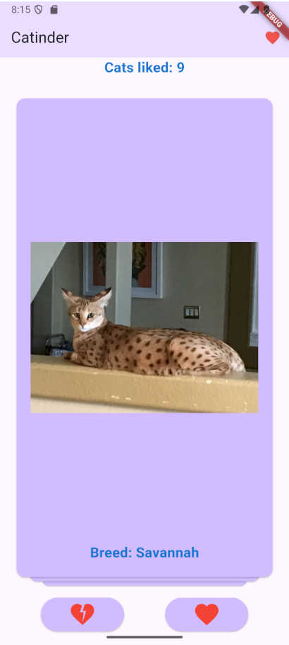
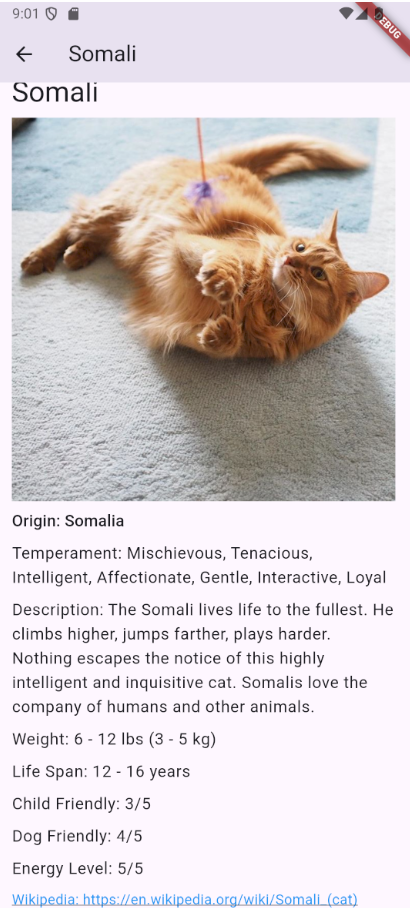
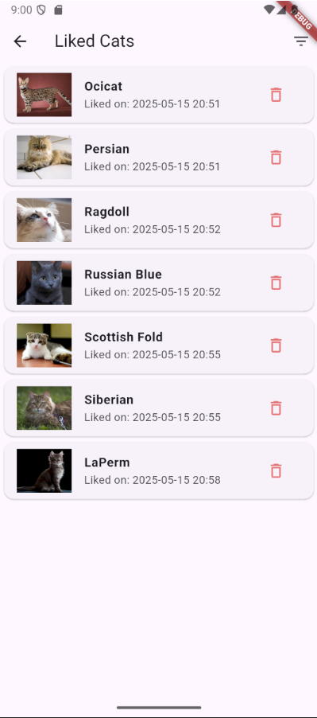
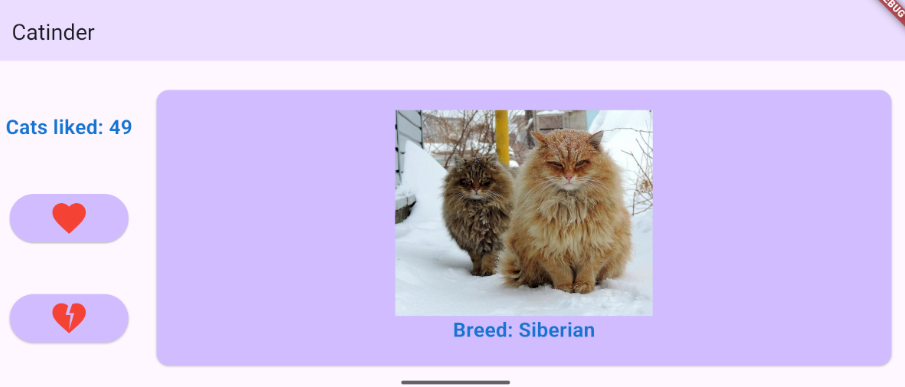
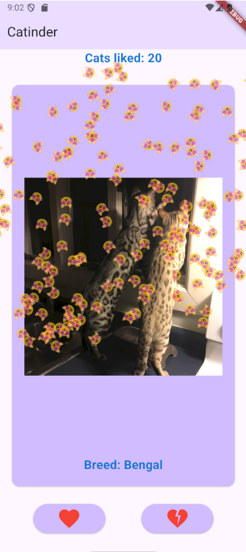

# 🐱 Catinder - Приложение для любителей котиков! 🐾

Добро пожаловать в **Catinder** — интерактивное приложение, которое позволит вам наслаждаться милыми котиками, узнавать их породы и отмечать изображения, которые вам нравятся! Просто свайпайте, лайкайте и изучайте информацию о породах кошек. Это приложение создано для всех, кто любит кошек и хочет провести время с удовольствием.

---

## 📱 Основной функционал

### 🖼️ Главный экран
- **Случайное изображение котика**: На главном экране отображается случайное изображение котика и название его породы.
- **Свайп влево/вправо**: Смахивайте изображение влево или вправо, чтобы перейти к следующему котику.
- **Кнопки лайк/дизлайк**: Используйте кнопки для выражения своих предпочтений.
- **Счетчик лайков**: При лайке (свайп вправо или нажатие на кнопку) счетчик увеличивается.

### 😻 Экран лайков
- **Список лайков**: На экране лайков отображается полный список понравившихся котиков с указанием пород и дат лайка.
- **Удаление лайков**: Нажмите на корзину, чтобы удалить котика из списка понравившихся (с подтверждением через диалог).
- **Фильтрация**: Посмотрите список всех понравившихся котиков данной породы.

### 🐾 Детальное описание
- **Тап по изображению**: Нажмите на изображение котика, чтобы открыть экран с детальной информацией о породе.
- **Подробная информация**: На экране описания отображается изображение котика и вся информация о его породе.

### 📱 Адаптивный интерфейс
- **Адаптивная верстка**: Приложение адаптируется под любые устройства, обеспечивая удобный интерфейс как на вертикальных, так и на горизонтальных экранах.

---

## 🛠️ Реализованные фичи

- [x] Отображение случайного изображения котика и названия породы.
- [x] Свайп влево/вправо для смены котика.
- [x] Кнопки лайк/дизлайк для выражения предпочтений.
- [x] Счетчик лайков, который увеличивается при лайке.
- [x] Экран детального описания с информацией о породе.
- [x] Адаптивный интерфейс для всех типов устройств.
- [x] Список всех лайкнутых котиков.
- [x] Возможность удаления котиков из списка лайкнутых.
- [x] Возможность фильтрации лайкнутых котиков по породам.
- [x] Сохранение списка лайкнутых котиков.
- [x] Возможность просматривать котиков оффлайн.

---

## 📸 Скриншоты интерфейса

  
*Главный экран с изображением котика и кнопками лайк/дизлайк.*

  
*Экран с детальной информацией о породе котика.*

  
*Экран с со списком всех лайкнутых котиков.*

  
*Приложение адаптируется под ваш экран*

  
*Красивые эффекты-частицы при нажатии лайка или дизлайка*

---

## 📥 Скачать приложение

Хотите попробовать? Скачайте актуальную версию APK по ссылке:  
[Скачать Catinder APK]([https://github.com/Vvil1568/Catinder/releases/download/release/catinder.apk](https://github.com/Vvil1568/Catinder/releases/download/release_pro/app-release.apk))

---

## 🚀 Технологии

- **Стек технологий**: Dart/Flutter
- **API**: Используется открытое API для получения изображений и информации о котиках.
- **Адаптивная верстка**: LayoutBuilder.

---

## 🤝 Как поддержать проект

Если вам понравилось приложение, поставьте ⭐️ на GitHub и поделитесь с друзьями! Ваша поддержка вдохновляет на дальнейшее развитие.

---

**Catinder** — это не просто приложение, это ваш личный источник радости и умиления! 🐱✨
